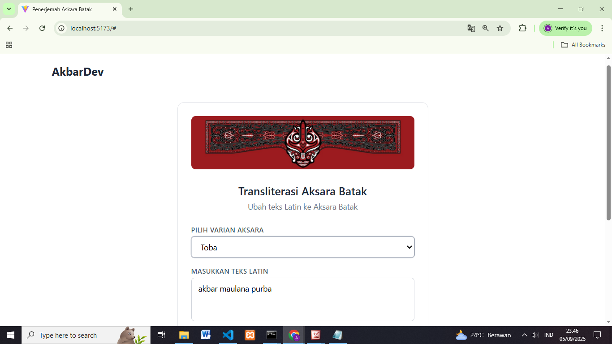

# 🚀 Translate_batak-app Project

> Project ini adalah aplikasi untuk menerjemahkan aksara Batak ke Latin secara otomatis.  
> Dibuat dengan ❤️ menggunakan Node.js + React.

---

## ✨ Fitur
- 🔤 Translasi Latin ↔ Batak
- 🌐 API Backend dengan Express
- 🎨 UI minimalis pakai React + Tailwind

---

## 📸 Screenshot


---

## ⚡ Instalasi

```bash
git clone https://github.com/username/project.git
cd project
npm install
npm start
